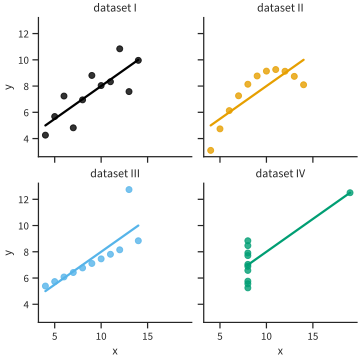
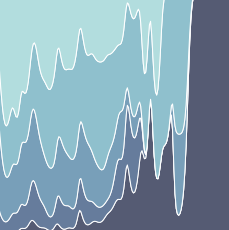
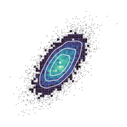
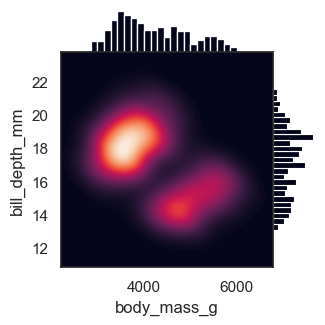
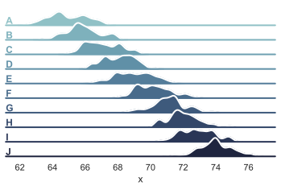

# Section

Integer at enim eu tellus malesuada scelerisque. Ut sed rhoncus ipsum, at tempor
nisl. Vivamus vitae pulvinar leo, at pharetra massa. Ut lobortis odio non nulla
tincidunt pulvinar. Nunc faucibus pellentesque elit, non ornare risus suscipit
sed. Maecenas vel blandit ex. Phasellus ultrices mi non nulla hendrerit, at
rhoncus augue suscipit. Pellentesque a lectus eget felis maximus feugiat nec ut
ante. Sed eget laoreet lectus. Vestibulum iaculis enim nec libero sollicitudin,
id rhoncus libero consectetur. Integer eget sem quis urna vulputate aliquet.

## Subsection 1

In mollis tortor vel ante cursus, ac consectetur nibh commodo. Aenean ultricies
ornare ante ac fermentum. Vestibulum malesuada lectus at pellentesque hendrerit.
Praesent a tempor ex, eget iaculis mauris. Integer turpis nunc, varius ac
posuere consequat, molestie sed felis. Fusce cursus velit eu magna pellentesque
posuere sed eget ex. Vivamus in gravida quam, in volutpat erat.

## Subsection 2

### Subsubsection 1

Suspendisse erat est, imperdiet sed dolor at, sagittis lobortis tortor. Nulla
facilisi. Aliquam pharetra scelerisque auctor. Duis vel auctor ipsum. Nullam
sagittis feugiat mollis. Aliquam at ultrices libero. Nulla facilisi. Fusce sed
est placerat, fringilla augue at, pretium nisl.

### Subsubsection 2

In ut nunc libero. Duis eu elementum purus. Etiam dictum, ipsum nec aliquam
lobortis, magna magna pellentesque ligula, sed ultricies odio ligula vitae orci.
Fusce bibendum maximus ligula, id gravida felis dictum a. In dapibus nulla eget
volutpat vulputate. Quisque congue erat quis nibh molestie, eget varius eros
ultrices.

#### Paragraph

Proin eleifend lorem semper, commodo tellus nec, porta purus. Nullam commodo
lectus nibh, consequat maximus lorem faucibus in. Nam purus eros, rutrum in
sapien et, condimentum lacinia nibh.

# Typography

* **Bold**
* _Italic_
* **_Bold italic_**.

# Numbers

* Normal: 0123456789
* Math: $0123456789$

# Acronyms

\acrodef{CMU}{Carnegie Mellon University}
\acrodef{USA}{United States of America}

* Default: \ac{CMU}
* Repeated: \ac{CMU}
* Forced short: \acs{USA}
* Repeated after forced short: \ac{USA}

# Math {#sec:math}

\newcommand{\PP}[2]{\mathbb{P}_{#1}\left[{#2}\right]}
\newcommand{\XX}{\mathcal{X}}
\newcommand{\EE}[2]{\mathbb{E}_{#1}\left[{#2}\right]}

* Inline: $\int_0^\infty \exp^{-x^2}\,\mathrm{d}x$
* Block: @eq:ex1
* Aligned: @eq:ex2
* Commands defined in body: $\PP{}{x \in \XX}$

$$
\int_0^\infty \exp^{-x^2}\,\mathrm{d}x
$$ {#eq:ex1}

$$
\begin{align*}
    x &= 1\\
    x + y &= 10\\
    x + y + z &= 100
\end{align*}
$$ {#eq:ex2}

# References

* Section: @sec:math
* Appendix section: @sec:app1
* Appendix figure: @fig:appex1
* Short citation[@einstein].
* Long citation: @latexcompanion
* Multiple citations[@einstein; @knuthwebsite].
* Pointer to a footnote[^1].

[^1]: Example footnote text.

# Includes

* Commands from metadata include: $\argmin$ $\R$
* Include command in body:



# Tables

* @tbl:ex1
* @tbl:ex2

Col1       Col2     Col3     Col4
------   ------    ------    ------
1             2     3        4
11           22     33       44
111         222     333      444

: Short table {#tbl:ex1}

 Col1      Col2      Col3      Col4     Col5      Col6      Col7      Col8
-----     -----     -----     -----    -----     -----     -----     -----
    a         1         2         3      123      abcd      1234       444
    b        11        22        33      456      efgh       567        44
    c       111       222       333      789      ijkl        89         4

: Wide table {#tbl:ex2}

# Figures

* @fig:ex1
* @fig:ex2
* @fig:ex3
* @fig:ex4, @fig:ex4a, @fig:ex4b

{#fig:ex1 darksrc="figures/anscombe_dark.svg"}

{#fig:ex2 darksrc=""}

{#fig:ex3}

{#fig:ex4a darksrc=""}
\qquad
{#fig:ex4b height=3in}

Figure with subfigures

